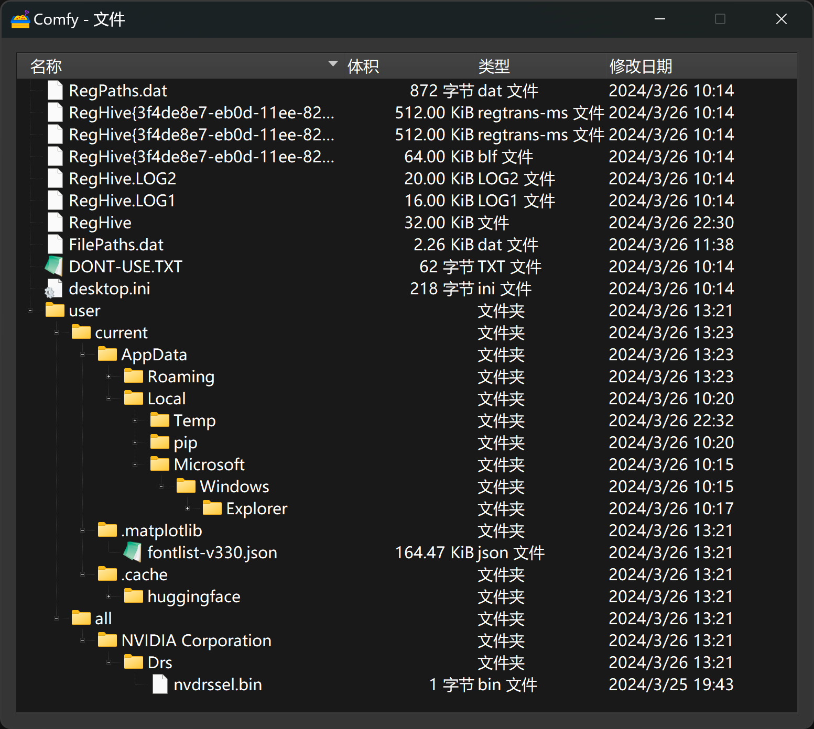

# Portable Windows package for ComfyUI

Similar to ComfyUI official
https://github.com/comfyanonymous/ComfyUI/releases[Standalone Portable]
but preloaded with many customs nodes and python packages with dependencies solved.

*link:README.zh.adoc[＞＞ 中文说明点我 ＜＜]*

The rest of README was translated by ChatGPT and edited by me (how lazy, how good😙).

== Features

* Pre-installed with ~30 custom nodes including:

** link:https://github.com/MrForExample/ComfyUI-3D-Pack[ComfyUI-3D-Pack] 
with dependencies that make my head spin

** link:https://github.com/WASasquatch/was-node-suite-comfyui/blob/main/requirements.txt[WAS Node Suite]
with fixed dependencies (prone to version chaos) and no longer actively developed

** link:https://github.com/Gourieff/comfyui-reactor-node[ReActor Node]
and 
link:https://github.com/ltdrdata/ComfyUI-Impact-Pack[Impact Pack]
that download model files on the first run (often causing freezing for users with bad Internet Connection)

* Includes 240+ Python packages, versions compatible, including:
** Packages like `insightface` and `dlib` which often throw "compiler not found" during installation
** Packages like link:https://github.com/openai/CLIP[CLIP] that require compilation from a git repository
** ONNX Runtime, which often throws "CUDAExecutionProvider Not Available". But the one in the package not only works, but also supports CUDA 12.1
** xFormers. I know it's not included in the ComfyUI official package for a good reason. See details in <<xformers, About xFormers>>.

* Only a few functional models that might slow down the program startup are pre-installed; users please prepare SD models of your favorite.

== How to Use

1. Only NVIDIA graphics cards are supported, preferably with the latest drivers installed.
** AMD graphics cards may __possibly__ work with ZLUDA after installing the HIP SDK, and this requires modifying startup parameters, among other things.

2. Download the integration package from the release page:
** https://github.com/YanWenKun/ComfyUI-Windows-Portable/releases
** Note that there are multiple files (compressed in volumes) that need to be downloaded and extracted.

3. Place SD models in `ComfyUI\models\checkpoints`.
** Subdirectories can be created for better organization.

4. If model files are already saved in another location and you don't want to move them, you can configure the program to load them:
** Rename `extra_model_paths.yaml.example` in the `ComfyUI` directory to `extra_model_paths.yaml`.
** Edit `extra_model_paths.yaml` according to the directory structure, removing corresponding comments.
** Items other than `base_path` can be added or removed freely to map newly added subdirectories; the program will try load all of them.

5. If a network proxy is needed, edit `run_nvidia_gpu.bat` and add the following at the beginning:
[source,cmd]
set HTTP_PROXY=http://localhost:1081
set HTTPS_PROXY=http://localhost:1081

6. Run `run_nvidia_gpu.bat` to start ComfyUI.

7. After starting, the program will automatically open a browser, or you can visit: http://localhost:8188/
** If you don't want the browser to open automatically, edit `run_nvidia_gpu.bat` and add the startup parameter `--disable-auto-launch`.

8. If you need to install more custom nodes or update ComfyUI and custom nodes, you can use ComfyUI-Manager (found in the bottom right corner of the ComfyUI page).

9. Besides SD models, some custom nodes may require downloading more models, such as the 
link:https://huggingface.co/stabilityai/TripoSR/blob/main/model.ckpt[TripoSR]
used in 3D workflows.
However, including all of them would make the package too large, so they were not included.
Moreover, you still need MS VC++ for some GPU-related codes to be compiled in runtime.
If you need to use the corresponding nodes, please pay attention to the respective project pages.

== Details

=== Pre-installed Custom Node List

====
* link:https://github.com/bash-j/mikey_nodes[mikey_nodes]
* link:https://github.com/chrisgoringe/cg-use-everywhere[cg-use-everywhere]
* link:https://github.com/crystian/ComfyUI-Crystools[ComfyUI-Crystools]
* link:https://github.com/cubiq/ComfyUI_essentials[ComfyUI_essentials]
* link:https://github.com/cubiq/ComfyUI_IPAdapter_plus[ComfyUI_IPAdapter_plus]
* link:https://github.com/Fannovel16/comfyui_controlnet_aux[comfyui_controlnet_aux]
* link:https://github.com/Fannovel16/ComfyUI-Frame-Interpolation[ComfyUI-Frame-Interpolation]
* link:https://github.com/FizzleDorf/ComfyUI_FizzNodes[ComfyUI_FizzNodes]
* link:https://github.com/florestefano1975/comfyui-portrait-master[comfyui-portrait-master]
* link:https://github.com/Gourieff/comfyui-reactor-node[comfyui-reactor-node]
* link:https://github.com/huchenlei/ComfyUI-layerdiffuse[ComfyUI-layerdiffuse]
* link:https://github.com/jags111/efficiency-nodes-comfyui[efficiency-nodes-comfyui]
* link:https://github.com/Kosinkadink/ComfyUI-Advanced-ControlNet[ComfyUI-Advanced-ControlNet]
* link:https://github.com/Kosinkadink/ComfyUI-AnimateDiff-Evolved[ComfyUI-AnimateDiff-Evolved]
* link:https://github.com/Kosinkadink/ComfyUI-VideoHelperSuite[ComfyUI-VideoHelperSuite]
* link:https://github.com/ltdrdata/ComfyUI-Impact-Pack[ComfyUI-Impact-Pack]
* link:https://github.com/ltdrdata/ComfyUI-Inspire-Pack[ComfyUI-Inspire-Pack]
* link:https://github.com/ltdrdata/ComfyUI-Manager[ComfyUI-Manager]
* link:https://github.com/mcmonkeyprojects/sd-dynamic-thresholding[sd-dynamic-thresholding]
* link:https://github.com/MrForExample/ComfyUI-3D-Pack[ComfyUI-3D-Pack]
* link:https://github.com/MrForExample/ComfyUI-AnimateAnyone-Evolved[ComfyUI-AnimateAnyone-Evolved]
* link:https://github.com/Nuked88/ComfyUI-N-Sidebar[ComfyUI-N-Sidebar]
* link:https://github.com/pythongosssss/ComfyUI-Custom-Scripts[ComfyUI-Custom-Scripts]
* link:https://github.com/pythongosssss/ComfyUI-WD14-Tagger[ComfyUI-WD14-Tagger]
* link:https://github.com/rgthree/rgthree-comfy[rgthree-comfy]
* link:https://github.com/shiimizu/ComfyUI_smZNodes[ComfyUI_smZNodes]
* link:https://github.com/SLAPaper/ComfyUI-Image-Selector[ComfyUI-Image-Selector]
* link:https://github.com/twri/sdxl_prompt_styler[sdxl_prompt_styler]
* link:https://github.com/WASasquatch/was-node-suite-comfyui[was-node-suite-comfyui]
* link:https://github.com/ZHO-ZHO-ZHO/ComfyUI-InstantID[ComfyUI-InstantID]
====

Most of the popular custom nodes with difficult dependencies are compatible, and users can still install other custom nodes through ComfyUI-Manager.

If compatibility issues arise, you can try disabling conflicting nodes in ComfyUI-Manager.

[[xformers]]
=== About xFormers

The cross-attention mechanism in PyTorch 2.2+ performs well on Windows and is more consistent (albeit subtly), so it's understandable why the ComfyUI official package chose not to include xFormers.

Speed and memory usage of xFormers and Torch vary depending on the application scenario and require specific testing. You can add `--use-pytorch-cross-attention` to the ComfyUI startup parameters to disable xFormers.

Personally, I prefer to enable xFormers when generating videos.

Additionally, including xFormers satisfies the dependencies of some nodes like link:https://github.com/MrForExample/ComfyUI-AnimateAnyone-Evolved/blob/main/requirements.txt[AnimateAnyone Evolved].

== Creating Your Own Integration Package

This repository utilizes a pipeline to build the integration package, and the codebase doesn't contain specific configurations or require additional access permissions. Hence, you can directly fork this repository to start executing the GitHub Workflow.

1. After forking, go to *Actions* on the page.
2. Locate *Gathering dependencies*.
** For example, it looks like this on my repository page: link:https://github.com/YanWenKun/ComfyUI-Windows-Portable/actions/workflows/step1-deps.yml[here]
3. Find *Run Workflow* and click to execute.
** This process downloads and packages dependencies, generating a GitHub Actions cache file.
4. After the previous process completes, you can find the generated cache file in *Caches*.
** For example, it looks like this on my repository page: link:https://github.com/YanWenKun/ComfyUI-Windows-Portable/actions/caches[here]
** To repackage dependencies, you need to delete this cache first, as GitHub does not automatically overwrite caches with the same name.
5. Next, find *Assembling package* and click *Run Workflow* to execute it.
6. Once execution is complete, go to the *releases* page of your repository, where you'll find the newly generated draft for download or publish.

== Security

Files detected by Sandboxie as shown in the image; registry changes are not clear.

If you need to configure a sandbox, it is recommended to set the program directory (the parent directory of ComfyUI) to "Full Access" under "Resource Access."

.Complaints
In my personal experience, I use a sandbox not so much for security considerations but mainly to avoid various Python packages downloading files haphazardly. Especially Huggingface Hub likes to download to `%USERPROFILE%\.cache`, and some rough and ready nodes directly call its downloader, downloading Git LFS cache files rather than individual model files, which are neither intuitive nor convenient for copying and reusing. Of course, despite the complaints, sandboxing is mainly for easy cleaning of temporary files.

.Advertisement
Linux/WSL2 users may want to check out my link:https://github.com/YanWenKun/ComfyUI-Docker[ComfyUI-Docker], which is the exact opposite of the Windows integration package in terms of being large and comprehensive but difficult to update. I designed the Docker image with a meticulous eye, selecting a series of non-conflicting and latest version dependencies, and adhering to the KISS principle by only including ComfyUI-Manager, leaving the choice of custom nodes to the users. Not to mention the benefits of easy upgrades, easy cleanup, and secure isolation provided by container runtime itself.

== Development Philosophy

Originally, the code was copied from ComfyUI's GitHub workflow, but I found it difficult to debug, so I rewrote the script.

However, the packaging concept is similar: providing a self-contained, portable, and fully equipped environment with a pre-installed Python Embedded. The pipeline is also built in two stages: first, dependencies are made into a cache in phase 1 for reuse, then the latest codebase is added and packaged for release in phase 2.

The difference is that I didn't download wheels first and then install them in bulk like comfyanonymous did. Because dependency relationships are too tricky, I went straight to `pip install` for dependency solving.

ComfyUI considers the evolution of Python and CUDA versions and has multiple version releases. However, after installing a large number of Python packages and custom nodes, I found it difficult to move away from Python 3.11 + CUDA 12.1. Therefore, I only made this one version combination.

== Development Memo: Version Upgrades

To facilitate rapid development and debugging, I hardcoded the parameterized processes originally written by comfy into version numbers. Automatic updates are no longer feasible, but fortunately, the repository is not large, so a simple search and replace will do. Note that the field of AI changes rapidly and extensively, inevitably requiring some manual follow-up.

.Updating PIP Dependencies
* Run `bash generate-requirements.sh`.
* Then manually check `requirements.txt` and `requirements2.txt`.
Some nodes' dependencies are quite tricky, requiring manual selection to ensure that they don't conflict during installation and can still run in the end.

.Upgrading Python Patch Versions
* Search and replace `3.11.8`.

.Upgrading Python Minor Versions
* Search and replace `3.11.8`.
* Search and replace `3.11`.
* Search and replace `cp311`.
* Search and replace `py311`.
* Search and replace `python311`.
* Finally, search `311` to see if anything was missed.

.Upgrading CUDA Versions
* Search and replace `cu121`.
* Search and replace `12.1`.

.Checking Files
* CI starts ComfyUI before packaging, to let custom nodes download model files (a common first-run behavior).
* However, some nodes/Py packages generate some localized files at startup (such as configuration files containing absolute paths), which are cleared during the "Clean up" section of `step2.sh`.
* Changing dependencies or adding custom nodes may cause changes to these files; use Sandboxie to monitor file changes during runtime and make additions or modifications.

== Thanks

Thanks to the link:https://github.com/comfyanonymous/ComfyUI/tree/master/.github/workflows[ComfyUI GitHub workflow], from which I drew inspiration. The initial code was also copied from there.

