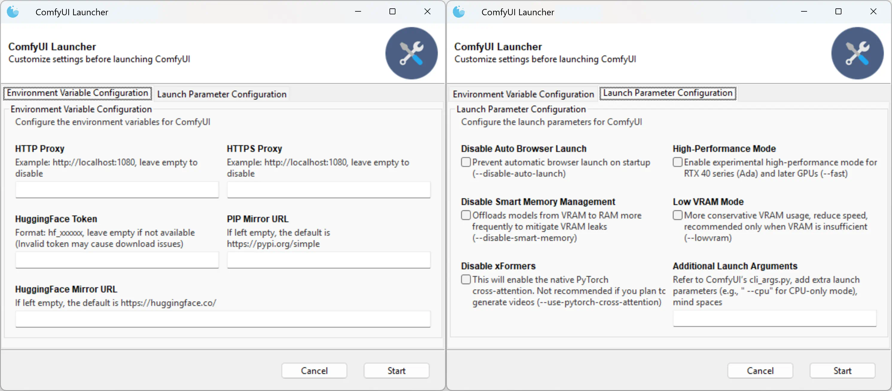

[.text-center]
English | *link:README.zh.adoc[中文说明]*

# Portable package for ComfyUI on Windows

image::docs/screenshot.webp["Screenshot"]

Similar to the 
https://github.com/Comfy-Org/ComfyUI/releases[ComfyUI official standalone portable],
but preloaded with numerous custom nodes and Python packages, with all dependencies resolved and ready to use.

== Features

* Pre-installed 40+ commonly-used custom nodes. <<custom-nodes, [Full List]>>

** With all the model files that need to be downloaded on the first run (which may cause freezing for users with a poor Internet connection).

* Pre-installed 300+ mutually compatible Python packages, including: 

** Performance optimization libraries such as SageAttention, FlashAttention, xFormers and Nunchaku.

** Packages that require native compilation during installation (e.g., insightface, dlib, etc.), already built and ready to use.

* Only a few functional models are pre-installed; users please prepare model files of your favorite.

* This repository uses the GitHub pipeline for packaging, making it easy for DIY. No need to configure CI/CD, simply fork this repository on GitHub to run the packaging script. See <<build-your-own, Creating Your Own All-In-One Package>>.

== How to Use

. Only NVIDIA GPUs (2018 or newer) are supported. Installing the latest driver is strongly recommended.

. Download the package files from the
https://github.com/YanWenKun/ComfyUI-Windows-Portable/releases[release page].

** Or you can download them directly:
*** https://github.com/YanWenKun/ComfyUI-Windows-Portable/releases/latest/download/ComfyUI_Windows_portable_cu130.7z.001[ComfyUI_Windows_portable_cu130.7z.001]
*** https://github.com/YanWenKun/ComfyUI-Windows-Portable/releases/latest/download/ComfyUI_Windows_portable_cu130.7z.002[ComfyUI_Windows_portable_cu130.7z.002]
*** https://github.com/YanWenKun/ComfyUI-Windows-Portable/releases/latest/download/models.zip[models.zip] (If you are upgrading from a previous release, you don't need this file.)

. After downloading the files, place them in the same directory, then open and extract the `001` file.
** Extract to a shallow directory path, such as `C:\AI\`, to avoid errors caused by long paths (exceeding the MAX_PATH limit of 260 characters).

** You do not need to open the `002` file. The extraction software will automatically handle it when decompressing the `001` file. They are two parts of a single large archive created using "split compression".
** You can use https://www.7-zip.org/[7-Zip] for extraction.

. Open the `models.zip` and extract it to the same place. 

. Place your model files under `ComfyUI\models\`.

. Run `RUN_Launcher.bat` to start.

* After launching, the program will automatically open a browser. You can also manually access: http://localhost:8188/.

* Close the window to exit the program.

== Tips

. Take full advantage of ComfyUI-Manager (the *Manager* button in the top-right of the ComfyUI page) to manage Custom Nodes: install, update, disable, and uninstall.
** You can click the "Update ComfyUI" button daily to get the latest workflow templates and related updates. This feature does not affect your installed Custom Nodes.
** Be cautious when using "Update All"; there's no need to update unused nodes to avoid Python package conflicts.

[[custom-nodes]]
== Pre-installed Custom Node List

[cols=3]
|===
3+|**Workspace**
|link:https://github.com/ltdrdata/ComfyUI-Manager[ComfyUI Manager]
|link:https://github.com/crystian/ComfyUI-Crystools[Crystools]
|link:https://github.com/pydn/ComfyUI-to-Python-Extension[ComfyUI-to-Python-Extension]
3+|**Performance**
|link:https://github.com/nunchaku-tech/ComfyUI-nunchaku[Nunchaku]
|link:https://github.com/city96/ComfyUI-GGUF[GGUF]
|link:https://github.com/woct0rdho/ComfyUI-RadialAttn[RadialAttention]
3+|**General**
|link:https://github.com/Suzie1/ComfyUI_Comfyroll_CustomNodes.git[Comfyroll Studio]
|link:https://github.com/cubiq/ComfyUI_essentials[ComfyUI Essentials by cubiq]
|link:https://github.com/pythongosssss/ComfyUI-Custom-Scripts[Custom Scripts by pythongosssss]
|link:https://github.com/jags111/efficiency-nodes-comfyui[Efficiency Nodes by jags111]
|link:https://github.com/kijai/ComfyUI-KJNodes[KJNodes]
|link:https://github.com/bash-j/mikey_nodes[Mikey Nodes]
|link:https://github.com/mirabarukaso/ComfyUI_Mira[Mira Nodes]
|link:https://github.com/rgthree/rgthree-comfy[rgthree Nodes]
|link:https://github.com/shiimizu/ComfyUI_smZNodes[smZ(shiimizu) Nodes]
|link:https://github.com/chrisgoringe/cg-use-everywhere[Use Everywhere]
|link:https://github.com/ltdrdata/was-node-suite-comfyui[WAS Node Suite]
|link:https://github.com/yolain/ComfyUI-Easy-Use[ComfyUI-Easy-Use]
3+|**Control**
|link:https://github.com/Kosinkadink/ComfyUI-Advanced-ControlNet[Advanced ControlNet]
|link:https://github.com/Fannovel16/comfyui_controlnet_aux[ControlNet Auxiliary Preprocessors]
|link:https://github.com/Jonseed/ComfyUI-Detail-Daemon[Detail Daemon]
|link:https://github.com/huchenlei/ComfyUI-IC-Light-Native[IC-Light Native]
|link:https://github.com/ltdrdata/ComfyUI-Impact-Pack[Impact Pack]
|link:https://github.com/ltdrdata/ComfyUI-Impact-Subpack[Impact Subpack]
|link:https://github.com/ltdrdata/ComfyUI-Inspire-Pack[Inspire Pack]
|link:https://github.com/cubiq/ComfyUI_IPAdapter_plus[IPAdapter plus]
|link:https://github.com/chflame163/ComfyUI_LayerStyle[Layer Style]
|link:https://github.com/huchenlei/ComfyUI-layerdiffuse[LayerDiffuse]
|link:https://github.com/florestefano1975/comfyui-portrait-master[Portrait Master]
|link:https://github.com/mcmonkeyprojects/sd-dynamic-thresholding[SD Dynamic Thresholding]
|link:https://github.com/twri/sdxl_prompt_styler[SDXL Prompt Styler]
|
|
3+|**Video**
|link:https://github.com/Kosinkadink/ComfyUI-AnimateDiff-Evolved[AnimateDiff Evolved]
|link:https://github.com/FizzleDorf/ComfyUI_FizzNodes[FizzNodes]
|link:https://github.com/Fannovel16/ComfyUI-Frame-Interpolation[Frame Interpolation (VFI)]
|link:https://github.com/melMass/comfy_mtb[MTB Nodes]
|link:https://github.com/Kosinkadink/ComfyUI-VideoHelperSuite[Video Helper Suite]
|
3+|**More**
|link:https://github.com/kijai/ComfyUI-DepthAnythingV2[Depth Anything V2 by kijai]
|link:https://github.com/akatz-ai/ComfyUI-DepthCrafter-Nodes[DepthCrafter by akatz]
|link:https://github.com/kijai/ComfyUI-Florence2[Florence-2 by kijai]
|link:https://github.com/SLAPaper/ComfyUI-Image-Selector[Image Selector]
|link:https://github.com/digitaljohn/comfyui-propost[ProPost]
|link:https://github.com/ssitu/ComfyUI_UltimateSDUpscale.git[Ultimate SD Upscale]
|link:https://github.com/pythongosssss/ComfyUI-WD14-Tagger[WD 1.4 Tagger]
|
|
|===

If compatibility issues arise, you can try disabling conflicting nodes in ComfyUI-Manager.

== Advanced Information

. The `ExtraScripts` folder contains command-line launch scripts, which are equivalent to the launcher. 

. For power users, consider using https://github.com/sandboxie-plus/Sandboxie/releases[Sandboxie] to limit cache files while isolating the environment.
** For better I/O performance when using Sandboxie, it is recommended to configure the program's main directory (`ComfyUI_Windows_portable`) as "Open Access" in "Sandbox Options" -> "Resource Access".

=== 3. External Model Directory

If you place model files on different partitions or share a set of model files across multiple ComfyUI instances,
you can configure ComfyUI to load external model directories:

* Rename `extra_model_paths.yaml.example` in the `ComfyUI` directory, removing the `.example` suffix.

* Edit `extra_model_paths.yaml`, where lines starting with `#` are comments.

.Reference file (click to expand)
[%collapsible]
====
----
comfyui:
    base_path: D:\models\
    animatediff_models: animatediff_models
    animatediff_motion_lora: animatediff_motion_lora
    bert-base-uncased: bert-base-uncased
    checkpoints: checkpoints
    clip: clip
    clip_vision: clip_vision
    configs: configs
    controlnet: controlnet
    depthfm: depthfm
    diffusers: diffusers
    diffusion_models: |
        diffusion_models
        unet
    embeddings: embeddings
    facerestore_models: facerestore_models
    gligen: gligen
    grounding-dino: grounding-dino
    hypernetworks: hypernetworks
    insightface: insightface
    instantid: instantid
    ipadapter: ipadapter
    loras: loras
    mmdets: mmdets
    onnx: onnx
    photomaker: photomaker
    reactor: reactor
    rembg: rembg
    sams: sams
    style_models: style_models
    text_encoders: text_encoders
    ultralytics: ultralytics
    unet: unet
    upscale_models: upscale_models
    vae: vae
    vae_approx: vae_approx
----
====

=== 4. More External Model Directories

ComfyUI has five common locations for saving model files:

* The built-in `ComfyUI\models` directory.
* External model directories configured via `extra_model_paths.yaml`.
* Model files downloaded via HuggingFace Hub (HF official downloader).
* Model files downloaded via PyTorch.
* Files downloaded in-place by nodes in `ComfyUI\custom_nodes`.

Among these:

* HF Hub defaults to downloading files to `C:\Users\UserName\.cache\huggingface\hub`.
* PyTorch defaults to downloading files to `C:\Users\UserName\.cache\torch\hub`.

This package modifies the launch script to redirect these to the program's root directory, under `HuggingFaceHub` and `TorchHome` folders, respectively, for easier management. If needed, you can edit the launch script to change these paths.

[[build-your-own]]
== Creating Your Own All-In-One Package

image:https://github.com/YanWenKun/ComfyUI-Windows-Portable/actions/workflows/build.yml/badge.svg["GitHub Workflow Status",link="https://github.com/YanWenKun/ComfyUI-Windows-Portable/actions/workflows/build.yml"]

This repository utilizes a pipeline to build the package, and the codebase doesn't contain specific configurations or require additional access permissions. Hence, you can directly fork this repository to start executing the GitHub Workflow.

1. After forking, go to *Actions* on the page.
2. Locate *Build & Upload Package*.
** For example, the page in my repository looks like
https://github.com/YanWenKun/ComfyUI-Windows-Portable/actions/workflows/build.yml[this].
3. Click *Run Workflow*.
4. Wait about 20~40 minutes until the workflow run complete.
5. Go to the *releases* page of your repository, where you will find the newly generated draft, ready for download or editing.

== Development Idea

Originally, the code was copied from ComfyUI's GitHub workflow, but I found it difficult to debug, so I rewrote the script.

However, the packaging concept is similar: providing a self-contained, portable, and fully equipped environment with a pre-installed Python Embedded (now migrated to Python Standalone).

The difference is that I didn't download wheels first and then install them in bulk like Comfy did. Because dependency relationships are too tricky, I went straight to `pip install` for dependency solving.

As a note, a common issue with Python Embedded in such pre-installed packages is that most of the executables in the `Scripts` directory cannot run properly. This is because these executables are often Python command wrappers that invoke `python.exe` through an absolute path. Once the directory changes (or is relocated), they naturally fail to execute. Fortunately, this does not affect the current project significantly.

== See Also

* link:docs/bumping-versions.adoc[Development Memo - Version Upgrades]

* link:docs/manual-setup.adoc[How To: Manually Setup ComfyUI]

== Thanks

Thanks to the link:https://github.com/Comfy-Org/ComfyUI/tree/master/.github/workflows[ComfyUI GitHub workflow], from which I drew inspiration.

