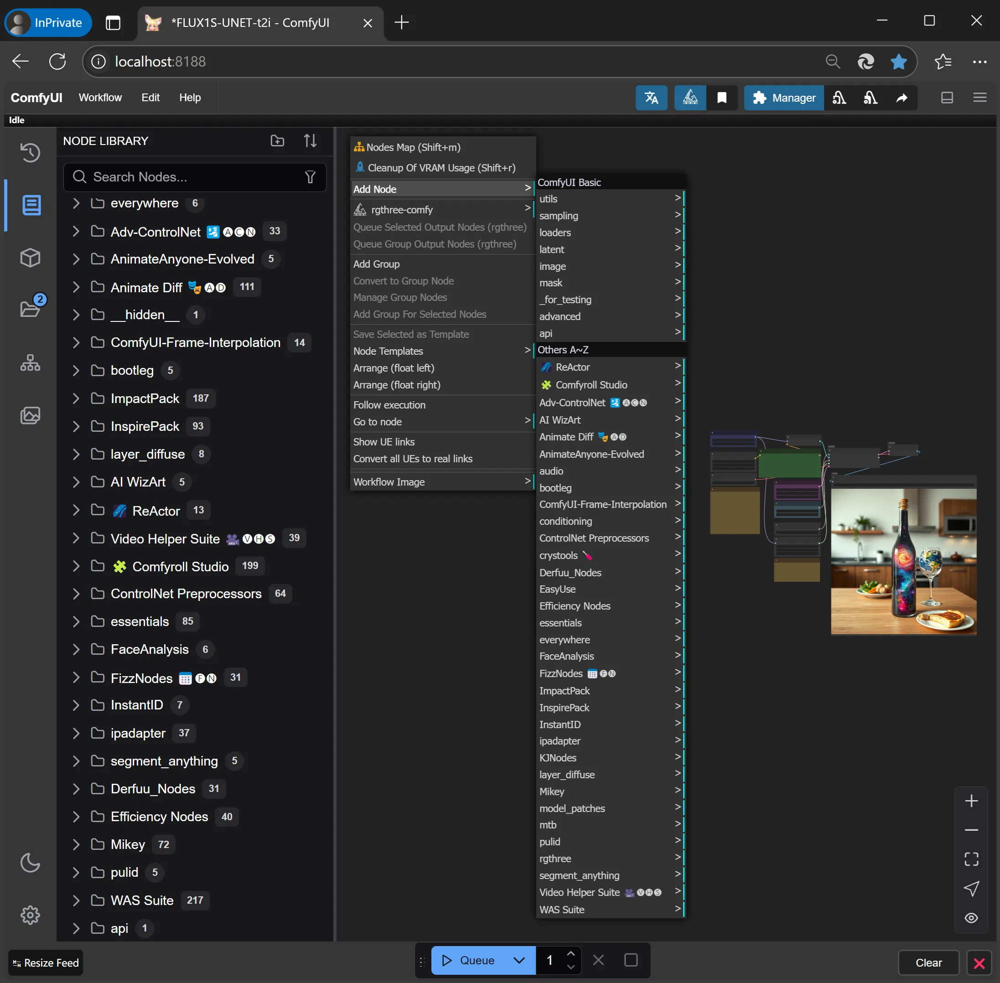

# Portable package for ComfyUI on Windows

[.text-center]
English | *link:README.zh.adoc[中文说明]*

Similar to the 
https://github.com/comfyanonymous/ComfyUI/releases[ComfyUI official standalone portable],
but preloaded with numerous custom nodes and Python packages, with all dependencies resolved.

== NEW: A Dedicated Package for ComfyUI-3D-Pack

For better compatibility,
I made a dedicated package for ComfyUI-3D-Pack:

https://github.com/YanWenKun/Comfy3D-WinPortable

New releases of this `ComfyUI-Windows-Portable` will not include 3D-Pack.
Previous releases will remain unchanged.

== Features

* Pre-installed with 50+ commonly-used custom nodes. <<custom-nodes, [Full List]>>

** With all the model files that need to be downloaded on the first run (which may cause freezing for users with a poor Internet connection).

* Includes 300+ mutually compatible Python packages, including: 

** `insightface`, `dlib`, etc., which require compilation during installation.

** xFormers, which is not included in the ComfyUI official package for an understandable reason. It may not be significant for text-to-image, but could be useful for video workflows.

* Only a few functional models are pre-installed; users please prepare SD models of your favorite.

* This repo uses the GitHub pipeline for packaging, making it easy for DIY. No need to configure CI/CD, simply fork the repository on GitHub to run the packaging script. See <<build-your-own, Creating Your Own AIO Package>>.

== How to Use

. Only NVIDIA GPUs are supported, preferably with the latest driver installed.

. Install https://git-scm.com/download/win[Git for Windows]. The setup will prompt you with several options; it's fine to use the default settings for all of them.

. Download the package files from the release page:
** https://github.com/YanWenKun/ComfyUI-Windows-Portable/releases
** Note that there are multiple files (`.7z.001`, `.7z.002` ...) that need to be downloaded.
** Open the `.7z.001` and extract it to a convenient place. If you can't open 7z files, install
https://www.7-zip.org/[7-zip]
or
https://peazip.github.io/peazip-64bit.html[PeaZip]
first.

. Place SD models in `ComfyUI\models\checkpoints`.
** Subdirectories can be created for better organization.

. Edit and run `run_nvidia_gpu.bat` to start ComfyUI.

** If you need to config HTTP proxy, follow the instruction in this file.

** If you don't want the browser to open automatically, add `--disable-auto-launch` to the startup arguments.

** If you're using 40/Ada series or newer GPU, you can try adding `--fast` to the startup arguments.
It has
https://github.com/comfyanonymous/ComfyUI/commit/9953f22fce0ba899da0676a0b374e5d1f72bf259[magic].

. After starting, the program will automatically open a browser, or you can visit: http://localhost:8188/

== Tips and Tricks

. Take full advantage of ComfyUI-Manager (the *Manager* button in the top-right corner of the ComfyUI page) to manage custom nodes: install, update, disable, and uninstall.
** Be cautious when using "Update All"; there's no need to update unused nodes to avoid Python package conflicts.

. To disable xFormers, add `--use-pytorch-cross-attention` to the ComfyUI startup parameters.
** This will enable the native PyTorch cross-attention. Once enabled, the time, VRAM usage, and image consistency for SD image generation may vary slightly.
** It is recommended not to disable xFormers if you plan to generate videos.

. For power users, consider using https://github.com/sandboxie-plus/Sandboxie/releases[Sandboxie] to limit cache files while isolating the environment.
** For better I/O performance when using Sandboxie, it is recommended to configure the program's main directory (`ComfyUI_Windows_portable`) as "Open Access" in "Sandbox Options" -> "Resource Access".

=== 4. External Model Directories

ComfyUI can load model files from directories outside of the main directory.
Here's how to configure it:

* Rename `extra_model_paths.yaml.example` in the `ComfyUI` directory to remove the `.example` suffix.
* Edit `extra_model_paths.yaml`, where lines starting with `#` are comments.

.Example file (click to expand)
[%collapsible]
====
----
comfyui:
    base_path: D:\models\
    animatediff_models: animatediff_models
    animatediff_motion_lora: animatediff_motion_lora
    bert-base-uncased: bert-base-uncased
    checkpoints: checkpoints
    clip: clip
    clip_vision: clip_vision
    configs: configs
    controlnet: controlnet
    depthfm: depthfm
    diffusers: diffusers
    diffusion_models: |
        diffusion_models
        unet
    embeddings: embeddings
    facerestore_models: facerestore_models
    gligen: gligen
    grounding-dino: grounding-dino
    hypernetworks: hypernetworks
    insightface: insightface
    ipadapter: ipadapter
    loras: loras
    mmdets: mmdets
    onnx: onnx
    photomaker: photomaker
    reactor: reactor
    rembg: rembg
    sams: sams
    style_models: style_models
    text_encoders: text_encoders
    ultralytics: ultralytics
    unet: unet
    upscale_models: upscale_models
    vae: vae
    vae_approx: vae_approx
----
====

=== 5. External HuggingFace Hub Directory

ComfyUI has three main locations for saving model files:

* The official `models` directory (and the aforementioned external model directory)
* Model files downloaded locally by each node in `custom_nodes`
* Model files downloaded via `HuggingFace Hub` (the official HF downloader)

By default, HF Hub downloads files to `C:\Users\UserName\.cache\huggingface\hub`.  
This package modifies this path to
`ComfyUI_Windows_portable\HuggingFaceHub`
in the startup script for easier file management.

If you have multiple ComfyUI instances and wants to share a common HF Hub model directory, modify the startup script as follows:

 set HF_HUB_CACHE=%~dp0\HuggingFaceHub

To something like:

 set HF_HUB_CACHE=D:\HuggingFaceHub

=== 6. How to Perform a "Swap-Out and Swap-In" Style Major Update

This method bypasses ComfyUI-Manager updates and directly replaces the old package with a new version.  
If done correctly, it avoids installing or upgrading Python packages, thus preventing dependency version conflicts.

. First, install https://git-scm.com/download/win[Git for Windows],  
and select Git Bash (default).

. Unzip the new version of pre-built package.
. Delete the `ComfyUI` and `HuggingFaceHub` folders in the new version.
. Copy the two folders from the old version into the new one.
. In the new main directory, open Git Bash (right-click in an empty area and select "Open Git Bash here").

. Copy and paste the following command in Git Bash (right-click to paste and hit Enter):

 bash force-update-all.sh

[start=7]
. Refer to the "How to Use" section to edit and run the startup script.

. If any nodes fail to load, you may need to click "try fix" in ComfyUI-Manager.

== Details

[[custom-nodes]]
=== Pre-installed Custom Node List

.Workspace
[cols=2]
|===
|link:https://github.com/ltdrdata/ComfyUI-Manager[ComfyUI Manager]
|link:https://github.com/crystian/ComfyUI-Crystools[Crystools]
|link:https://github.com/pydn/ComfyUI-to-Python-Extension[ComfyUI-to-Python-Extension]
|
|===

.General
[cols=2]
|===
|link:https://github.com/akatz-ai/ComfyUI-AKatz-Nodes[AKatz Nodes]
|link:https://github.com/Suzie1/ComfyUI_Comfyroll_CustomNodes.git[Comfyroll Studio]
|link:https://github.com/cubiq/ComfyUI_essentials[ComfyUI Essentials by cubiq]
|link:https://github.com/Derfuu/Derfuu_ComfyUI_ModdedNodes.git[Derfuu Modded Nodes]
|link:https://github.com/pythongosssss/ComfyUI-Custom-Scripts[Custom Scripts by pythongosssss]
|link:https://github.com/jags111/efficiency-nodes-comfyui[Efficiency Nodes by jags111]
|link:https://github.com/Amorano/Jovimetrix[Jovimetrix]
|link:https://github.com/kijai/ComfyUI-KJNodes[KJNodes]
|link:https://github.com/bash-j/mikey_nodes[Mikey Nodes]
|link:https://github.com/mirabarukaso/ComfyUI_Mira[Mira Nodes]
|link:https://github.com/rgthree/rgthree-comfy[rgthree Nodes]
|link:https://github.com/shiimizu/ComfyUI_smZNodes[smZ(shiimizu) Nodes]
|link:https://github.com/chrisgoringe/cg-use-everywhere[Use Everywhere]
|link:https://github.com/WASasquatch/was-node-suite-comfyui[WAS Node Suite]
|link:https://github.com/yolain/ComfyUI-Easy-Use[ComfyUI-Easy-Use]
|
|===

.Control
[cols=2]
|===
|link:https://github.com/Kosinkadink/ComfyUI-Advanced-ControlNet[Advanced ControlNet]
|link:https://github.com/Fannovel16/comfyui_controlnet_aux[ControlNet Auxiliary Preprocessors]
|link:https://github.com/Jonseed/ComfyUI-Detail-Daemon[Detail Daemon]
|link:https://github.com/huchenlei/ComfyUI-IC-Light-Native[IC-Light Native]
|link:https://github.com/ltdrdata/ComfyUI-Impact-Pack[Impact Pack]
|link:https://github.com/ltdrdata/ComfyUI-Impact-Subpack[Impact Subpack]
|link:https://github.com/ltdrdata/ComfyUI-Inspire-Pack[Inspire Pack]
|link:https://github.com/cubiq/ComfyUI_InstantID[InstantID by cubiq]
|link:https://github.com/cubiq/ComfyUI_IPAdapter_plus[IPAdapter plus]
|link:https://github.com/chflame163/ComfyUI_LayerStyle[Layer Style]
|link:https://github.com/cubiq/PuLID_ComfyUI[PuLID by cubiq]
|link:https://github.com/huchenlei/ComfyUI-layerdiffuse[LayerDiffuse]
|link:https://github.com/florestefano1975/comfyui-portrait-master[Portrait Master]
|link:https://github.com/Gourieff/ComfyUI-ReActor[ReActor Node]
|link:https://github.com/mcmonkeyprojects/sd-dynamic-thresholding[SD Dynamic Thresholding]
|link:https://github.com/twri/sdxl_prompt_styler[SDXL Prompt Styler]
|
|===

.Video
[cols=2]
|===
|link:https://github.com/Kosinkadink/ComfyUI-AnimateDiff-Evolved[AnimateDiff Evolved]
|link:https://github.com/FizzleDorf/ComfyUI_FizzNodes[FizzNodes]
|link:https://github.com/Fannovel16/ComfyUI-Frame-Interpolation[Frame Interpolation (VFI)]
|link:https://github.com/melMass/comfy_mtb[MTB Nodes]
|link:https://github.com/Kosinkadink/ComfyUI-VideoHelperSuite[Video Helper Suite]
|
|===

.More
[cols=2]
|===
|link:https://github.com/city96/ComfyUI-GGUF[ComfyUI-GGUF]
|link:https://github.com/kijai/ComfyUI-DepthAnythingV2[Depth Anything V2 by kijai]
|link:https://github.com/akatz-ai/ComfyUI-DepthCrafter-Nodes[DepthCrafter by akatz]
|link:https://github.com/cubiq/ComfyUI_FaceAnalysis[Face Analysis by cubiq]
|link:https://github.com/kijai/ComfyUI-Florence2[Florence-2 by kijai]
|link:https://github.com/SLAPaper/ComfyUI-Image-Selector[Image Selector]
|link:https://github.com/digitaljohn/comfyui-propost[ProPost]
|link:https://github.com/neverbiasu/ComfyUI-SAM2[Segment Anything 2 by neverbiasu]
|link:https://github.com/ssitu/ComfyUI_UltimateSDUpscale.git[Ultimate SD Upscale]
|link:https://github.com/pythongosssss/ComfyUI-WD14-Tagger[WD 1.4 Tagger]
|
|===

If compatibility issues arise, you can try disabling conflicting nodes in ComfyUI-Manager.

[[build-your-own]]
== Creating Your Own AIO Package

image:https://github.com/YanWenKun/ComfyUI-Windows-Portable/actions/workflows/build.yml/badge.svg["GitHub Workflow Status",link="https://github.com/YanWenKun/ComfyUI-Windows-Portable/actions/workflows/build.yml"]

This repository utilizes a pipeline to build the package, and the codebase doesn't contain specific configurations or require additional access permissions. Hence, you can directly fork this repository to start executing the GitHub Workflow.

1. After forking, go to *Actions* on the page.
2. Locate *Build & Upload Package*.
** For example, it looks like 
link:https://github.com/YanWenKun/ComfyUI-Windows-Portable/actions/workflows/build.yml[this]
on my repository page.
3. Click *Run Workflow*.
4. Wait about 20~40 minutes until the workflow run complete.
** If you want to speed up the compression process, edit
`stage3.sh`
and set the parameters to
`-mx=3 -mfb=32 -md=4m`.
This adjustment will reduce the workflow duration to under 15 minutes, at the cost of a larger file size.
5. Go to the *releases* page of your repository, where you'll find the newly generated draft for download or publish.

== Development Idea

Originally, the code was copied from ComfyUI's GitHub workflow, but I found it difficult to debug, so I rewrote the script.

However, the packaging concept is similar: providing a self-contained, portable, and fully equipped environment with a pre-installed Python Embedded.

The difference is that I didn't download wheels first and then install them in bulk like Comfy did. Because dependency relationships are too tricky, I went straight to `pip install` for dependency solving.

As a note, a common issue with Python Embedded in such pre-installed packages is that most of the executables in the `Scripts` directory cannot run properly. This is because these executables are often Python command wrappers that invoke `python.exe` through an absolute path. Once the directory changes (or is relocated), they naturally fail to execute. Fortunately, this does not affect the current project significantly.

== See Also

* link:docs/bumping-versions.adoc[Development Memo - Version Upgrades]

* link:docs/manual-setup.adoc[How To: Manually Setup ComfyUI]

== Thanks

Thanks to the link:https://github.com/comfyanonymous/ComfyUI/tree/master/.github/workflows[ComfyUI GitHub workflow], from which I drew inspiration.

