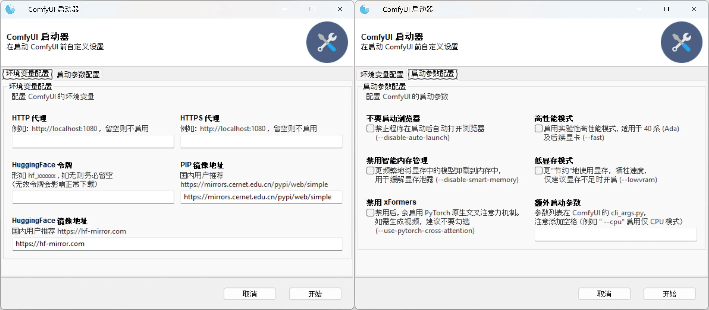

# ComfyUI Windows 多节点整合包

image::docs/screenshot.zh.webp["界面截图"]

[.text-center]
中文 | *link:README.adoc[English]*

类似 ComfyUI 官方的
https://github.com/Comfy-Org/ComfyUI/releases[Standalone Portable]
整合包，但是更大。

## 特点

* 预装了 40+ 常用自定义节点 <<custom-nodes, 【查看详细列表】>>

** 预装了部分模型文件，包括
https://github.com/ltdrdata/ComfyUI-Impact-Pack[Impact Pack]
会在初次启动时下载的模型文件等，避免启动时卡下载（访问 GitHub/HuggingFace 不畅）。

* 包含 300+ 互相兼容的 Python 包，包括：
** 性能库： SageAttention、FlashAttention、xFormers、Nunchaku 等
** 需要编译安装的 `insightface`、`dlib` 等

* 仅预置了少量功能性模型，绘图模型还请用户自行下载

* 使用 GitHub 流水线打包，方便 DIY。用户无需配置 CI/CD，只需在 GitHub 上 Fork 仓库，即可运行打包脚本 <<build-your-own, 【查看操作方法】>>

## 如何使用

. 仅支持 NVIDIA 显卡（20 系及以后），建议先装好最新驱动

. 在
https://github.com/YanWenKun/ComfyUI-Windows-Portable/releases[发布页面]
下载整合包文件，或者直接下载链接：

*** https://github.com/YanWenKun/ComfyUI-Windows-Portable/releases/latest/download/ComfyUI_Windows_portable_cu130.7z.001[ComfyUI_Windows_portable_cu130.7z.001]
*** https://github.com/YanWenKun/ComfyUI-Windows-Portable/releases/latest/download/ComfyUI_Windows_portable_cu130.7z.002[ComfyUI_Windows_portable_cu130.7z.002]
*** https://github.com/YanWenKun/ComfyUI-Windows-Portable/releases/latest/download/models.zip[models.zip] （模型包，如果是从之前版本升级，不需要下载）

** 打开 `.7z.001` 并解压（建议放在较浅的目录，比如 `C:\AI\` ，避免路径超长）

** 打开 `.zip` 并解压到同一个目录

** 无需再打开 `.7z.002` 文件，它已随 `001` 一同解压

. 将 SD 模型放到 `ComfyUI\models\checkpoints` 或 `ComfyUI\models\diffusion_models` 下

** 可随意建立子目录，便于分类

. 运行 `启动器.bat` 即可启动

* 启动后程序会自动打开浏览器，也可手动访问： http://localhost:8188/

* 关闭窗口即可退出程序

## 使用技巧

. 善加利用 ComfyUI-Manager （ComfyUI 页面右上角 *Manager* 按钮），用它来管理自定义节点（插件）：安装、更新、禁用、卸载。
** “更新 ComfyUI（Update ComfyUI）”可以获取最新的工作流模板等，该功能不影响自定义节点，可放心更新。
** “更新全部”需谨慎，用不到的节点没必要更新，避免 Python 包混乱。

[[custom-nodes]]
## 预置自定义节点列表

[cols=3]
|===
3+|**工作空间**
|link:https://github.com/ltdrdata/ComfyUI-Manager[ComfyUI Manager]
|link:https://github.com/crystian/ComfyUI-Crystools[Crystools]
|link:https://github.com/pydn/ComfyUI-to-Python-Extension[ComfyUI-to-Python-Extension]
3+|**性能**
|link:https://github.com/nunchaku-tech/ComfyUI-nunchaku[Nunchaku]
|link:https://github.com/city96/ComfyUI-GGUF[GGUF]
|link:https://github.com/woct0rdho/ComfyUI-RadialAttn[RadialAttention]
3+|**综合**
|link:https://github.com/Suzie1/ComfyUI_Comfyroll_CustomNodes.git[Comfyroll Studio]
|link:https://github.com/cubiq/ComfyUI_essentials[ComfyUI Essentials by cubiq]
|link:https://github.com/pythongosssss/ComfyUI-Custom-Scripts[Custom Scripts by pythongosssss]
|link:https://github.com/jags111/efficiency-nodes-comfyui[Efficiency Nodes by jags111]
|link:https://github.com/kijai/ComfyUI-KJNodes[KJNodes]
|link:https://github.com/bash-j/mikey_nodes[Mikey Nodes]
|link:https://github.com/mirabarukaso/ComfyUI_Mira[Mira Nodes]
|link:https://github.com/rgthree/rgthree-comfy[rgthree Nodes]
|link:https://github.com/shiimizu/ComfyUI_smZNodes[smZ(shiimizu) Nodes]
|link:https://github.com/chrisgoringe/cg-use-everywhere[Use Everywhere]
|link:https://github.com/ltdrdata/was-node-suite-comfyui[WAS Node Suite]
|link:https://github.com/yolain/ComfyUI-Easy-Use[ComfyUI-Easy-Use]
3+|**控制**
|link:https://github.com/Kosinkadink/ComfyUI-Advanced-ControlNet[Advanced ControlNet]
|link:https://github.com/Fannovel16/comfyui_controlnet_aux[ControlNet Auxiliary Preprocessors]
|link:https://github.com/Jonseed/ComfyUI-Detail-Daemon[Detail Daemon]
|link:https://github.com/huchenlei/ComfyUI-IC-Light-Native[IC-Light Native]
|link:https://github.com/ltdrdata/ComfyUI-Impact-Pack[Impact Pack]
|link:https://github.com/ltdrdata/ComfyUI-Impact-Subpack[Impact Subpack]
|link:https://github.com/ltdrdata/ComfyUI-Inspire-Pack[Inspire Pack]
|link:https://github.com/cubiq/ComfyUI_IPAdapter_plus[IPAdapter plus]
|link:https://github.com/chflame163/ComfyUI_LayerStyle[Layer Style]
|link:https://github.com/huchenlei/ComfyUI-layerdiffuse[LayerDiffuse]
|link:https://github.com/florestefano1975/comfyui-portrait-master[Portrait Master]
|link:https://github.com/mcmonkeyprojects/sd-dynamic-thresholding[SD Dynamic Thresholding]
|link:https://github.com/twri/sdxl_prompt_styler[SDXL Prompt Styler]
|
|
3+|**视频**
|link:https://github.com/Kosinkadink/ComfyUI-AnimateDiff-Evolved[AnimateDiff Evolved]
|link:https://github.com/FizzleDorf/ComfyUI_FizzNodes[FizzNodes]
|link:https://github.com/Fannovel16/ComfyUI-Frame-Interpolation[Frame Interpolation (VFI)]
|link:https://github.com/melMass/comfy_mtb[MTB Nodes]
|link:https://github.com/Kosinkadink/ComfyUI-VideoHelperSuite[Video Helper Suite]
|
3+|**更多**
|link:https://github.com/kijai/ComfyUI-DepthAnythingV2[Depth Anything V2 by kijai]
|link:https://github.com/akatz-ai/ComfyUI-DepthCrafter-Nodes[DepthCrafter by akatz]
|link:https://github.com/kijai/ComfyUI-Florence2[Florence-2 by kijai]
|link:https://github.com/SLAPaper/ComfyUI-Image-Selector[Image Selector]
|link:https://github.com/digitaljohn/comfyui-propost[ProPost]
|link:https://github.com/ssitu/ComfyUI_UltimateSDUpscale.git[Ultimate SD Upscale]
|link:https://github.com/pythongosssss/ComfyUI-WD14-Tagger[WD 1.4 Tagger]
|
|
|===

如安装新节点后遇到兼容性问题，可在 ComfyUI-Manager 中禁用冲突节点。

## 进阶技巧

. `备用脚本` 文件夹下包含了命令行启动脚本，其内容与启动器等价。

. 如果你讨厌程序产生的临时文件、下载缓存等，可以考虑使用 https://github.com/sandboxie-plus/Sandboxie/releases[Sandboxie] 沙盒来约束它们，同时隔离环境。
** 在使用沙盒时，为了 I/O 性能，建议在“沙盒选项”-“资源访问”中，将程序主目录（`ComfyUI_Windows_portable`）配置为“开放”。

### 3. 外部模型目录

如果你将模型文件放在不同的分区，或者多个 ComfyUI 实例共用一套模型文件，
可以配置 ComfyUI 加载外部模型目录：

* 将 `ComfyUI` 目录下的 `extra_model_paths.yaml.example` 重命名，去掉末尾的 `.example`

* 编辑 `extra_model_paths.yaml`，其中以 `#` 开头的部分为注释内容

.参考文件（点击展开）
[%collapsible]
====
----
comfyui:
    base_path: D:\models\
    animatediff_models: animatediff_models
    animatediff_motion_lora: animatediff_motion_lora
    bert-base-uncased: bert-base-uncased
    checkpoints: checkpoints
    clip: clip
    clip_vision: clip_vision
    configs: configs
    controlnet: controlnet
    depthfm: depthfm
    diffusers: diffusers
    diffusion_models: |
        diffusion_models
        unet
    embeddings: embeddings
    facerestore_models: facerestore_models
    gligen: gligen
    grounding-dino: grounding-dino
    hypernetworks: hypernetworks
    insightface: insightface
    instantid: instantid
    ipadapter: ipadapter
    loras: loras
    mmdets: mmdets
    onnx: onnx
    photomaker: photomaker
    reactor: reactor
    rembg: rembg
    sams: sams
    style_models: style_models
    text_encoders: text_encoders
    ultralytics: ultralytics
    unet: unet
    upscale_models: upscale_models
    vae: vae
    vae_approx: vae_approx
----
====

### 4. 更多外部模型目录

ComfyUI 有五处常见的模型文件保存位置：

* 内置的 `ComfyUI\models` 目录
* 通过 `extra_model_paths.yaml` 配置的外部模型目录
* 通过 HuggingFace Hub（HF 官方下载器）下载的模型文件
* 通过 PyTorch 下载的模型文件
* 各节点在 `ComfyUI\custom_nodes` 中原地下载的文件

其中：

* HF Hub 默认将文件下载到 `C:\Users\UserName\.cache\huggingface\hub`
** 本整合包修改到了 `程序目录\HuggingFaceHub`
* PyTorch 默认将文件下载到 `C:\Users\UserName\.cache\torch\hub`
** 本整合包修改到了 `程序目录\TorchHome`

如需修改，可在启动脚本中编辑。

[[build-your-own]]
## 我也想生成整合包！

image:https://github.com/YanWenKun/ComfyUI-Windows-Portable/actions/workflows/build.yml/badge.svg["GitHub 工作流状态",link="https://github.com/YanWenKun/ComfyUI-Windows-Portable/actions/workflows/build.yml"]

本仓库使用流水线构建整合包，直接 fork 本仓库即可开始执行 GitHub Workflow。代码库中不含特化配置，也不需要额外配置访问权限。

1. Fork 后，在页面中找到 *Actions*。
2. 找到 *Build & Upload Package*。
** 比如我代码库里的页面长
https://github.com/YanWenKun/ComfyUI-Windows-Portable/actions/workflows/build.yml[这样]
3. 找到 *Run Workflow*，点击运行。
4. 等待执行完毕（20~40分钟）
5. 找到仓库的 *releases* 页面，里面会有刚生成的草稿，即可下载或编辑发布。

## 开发理念

代码原本是抄的 ComfyUI 的 
https://github.com/Comfy-Org/ComfyUI/tree/master/.github/workflows[GitHub workflow]
，后来发现实在是难调试，就重写了一遍脚本。
但打包理念都差不多，都是自带一个免安装的 Python Embedded，半绿色，可移植，依赖项完备，解压即可运行。

（注：
https://www.python.org/downloads/windows/[Python Embedded]
现已替换为特性更完备、自带头文件的 
https://github.com/astral-sh/python-build-standalone[Python Standalone]
）

不同之处在于，我没有像 Comfy 一样先下载 wheel，再批量安装。因为依赖关系太棘手，我是直接走的 `pip install`，以便 PIP 解析。

当然，这类预装包的 Python Standalone 都有个通病：`Scripts` 目录下的 exe 大多无法正常执行。因这些 exe 多为 Python 命令套壳，并通过绝对路径执行 `python.exe`，一旦目录变动（移植）自然无法执行。所幸对本项目无甚影响。

## 开发备忘

* link:docs/bumping-versions.zh.adoc[开发备忘：升级版本]

## 感谢

感谢
https://github.com/Comfy-Org/ComfyUI/tree/master/.github/workflows[ComfyUI GitHub workflow]
，我的灵感来源于此，一开始的代码也是抄的这个。
