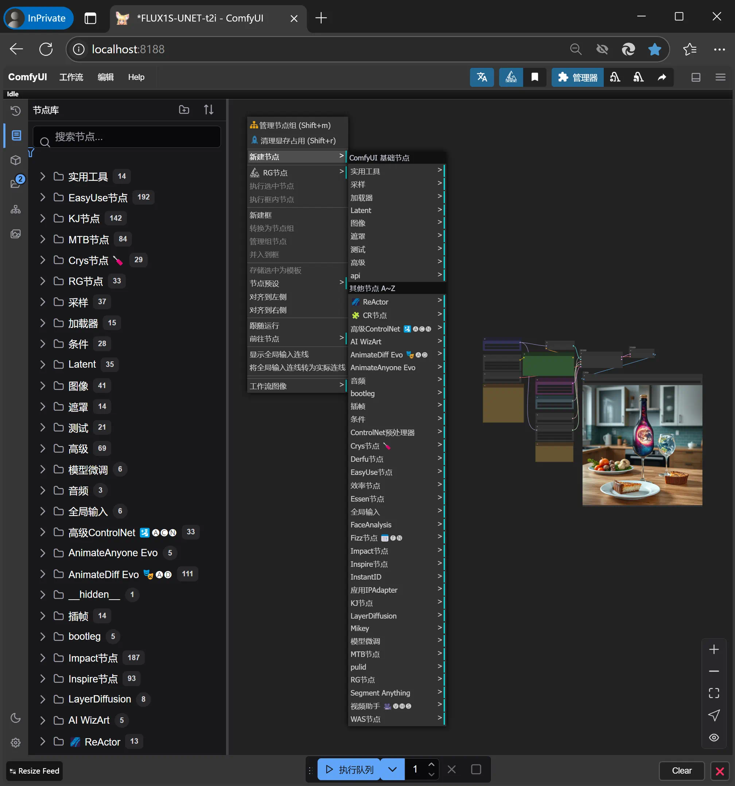

# ComfyUI Windows 多节点整合包

image:https://github.com/YanWenKun/ComfyUI-Windows-Portable/actions/workflows/build.yml/badge.svg["GitHub Workflow Status"]

类似 ComfyUI 官方的
https://github.com/comfyanonymous/ComfyUI/releases[Standalone Portable]
整合包，但是更大。

## 特点

* 预装了 30+ 自定义节点，包括：
** [.line-through]#依赖项看得人头皮发麻的#
https://github.com/MrForExample/ComfyUI-3D-Pack/[ComfyUI-3D-Pack]
（现在不麻了，官方带安装脚本了，可以用 ComfyUI-Manager 安装了）
** [.line-through]#依赖项版本固定（容易导致版本混乱）且不再活跃开发的#
https://github.com/WASasquatch/was-node-suite-comfyui/blob/main/requirements.txt[WAS Node Suite]
（现在改好了，版本不卡了）
** 初次启动时会下载模型文件（国内用户经常卡住不动）的
https://github.com/Gourieff/comfyui-reactor-node[ReActor Node]
、
https://github.com/ltdrdata/ComfyUI-Impact-Pack[Impact Pack]

* 包含 240+ 版本兼容的 Python 包，包括：
** 安装时经常“找不到编译器”的 `insightface`、`dlib`
** 需要从 git 仓库编译安装的 https://github.com/openai/CLIP[CLIP]
** 运行时经常“找不到 CUDA provider”的 ONNX Runtime，并支持 CUDA 12.1
** 官方包里没带的 xFormers，细节参见 <<xformers, 关于 xFormers>>.

* 仅预置了少量会卡程序启动的功能性模型，绘图模型还请用户自行下载。

## 如何使用

1. 仅支持 NVIDIA 显卡，最好先装好最新驱动
** AMD 显卡在安装 HIP SDK 后 __也许__ 能用 ZLUDA 启动，需要修改启动参数等

2. 在发布页面下载整合包：
** https://github.com/YanWenKun/ComfyUI-Windows-Portable/releases
** 注意有多个文件（压缩包分卷），需要全部下载后解压。

3. 将 SD 模型放到 `ComfyUI\models\checkpoints` 下
** 可以随意建立子目录，便于分类

4. *运行 `run_nvidia_gpu.bat` 即可启动程序。*

5. 启动后程序会自动打开浏览器，也可手动访问： http://localhost:8188/
** 如果不想自动打开浏览器，编辑 `run_nvidia_gpu.bat` 加上启动参数 `--disable-auto-launch`

6. 点击 ComfyUI 页面右上角的 齿轮（⚙）图标可修改设置，找到 *AGLTranslation* 可以修改语言（默认 English）。

## 使用技巧

1. 如果在其他位置已经保存了模型文件，且不想移动，可以配置程序加载：
** 将 `ComfyUI` 目录下的 `extra_model_paths.yaml.example` 重命名为 `extra_model_paths.yaml`
** 编辑 `extra_model_paths.yaml`，根据不同的目录结构，编辑掉对应的注释
** 除 `base_path` 外的条目都可以随意增删，用于映射新加的子目录，程序会全部加载

2. 如果需要挂代理，编辑 `run_nvidia_gpu.bat`，在开头加上：
[source,cmd]
set HTTP_PROXY=http://localhost:1081
set HTTPS_PROXY=http://localhost:1081

3. 善加利用 ComfyUI-Manager （ComfyUI 页面右下角 *Manager* 按钮），可用它来安装更多自定义节点，或更新 ComfyUI 及节点，也可以禁用不需要的节点。
** 如果觉得一些用不到的节点影响了启动时间，可以将其禁用。

4. 除了绘图模型外，一些自定义节点还需要下载更多模型，比如 3D 模型会用到的
https://huggingface.co/stabilityai/TripoSR/blob/main/model.ckpt[TripoSR]
，但如果都打包进来就太大了，这里权衡之下没有放。
此外 3D 相关的部分组件依然需要安装
https://visualstudio.microsoft.com/downloads/?q=build+tools[Visual Studio 2022]（选择安装“桌面C++开发”）
，因为有些 GPU 相关代码需要运行时编译（一些 Torch 的 JIT CPP 扩展）。
如果需要用到对应节点，还请留意相应的项目页面。

5. 如何大更新：ComfyUI-Manager 可以完成大部分的更新，但如果想要“翻新式”更新，可以先删除 `python_embeded` 目录，再将新版压缩包中的同名目录解压到原来位置即可。可能需要额外在 ComfyUI-Manager 中“try fix”。

## 细节

### 预置自定义节点列表

.工作空间
[cols=2]
|===
|link:https://github.com/ltdrdata/ComfyUI-Manager[ComfyUI Manager]
|link:https://github.com/AIGODLIKE/AIGODLIKE-ComfyUI-Translation[ComfyUI 翻译]
|link:https://github.com/crystian/ComfyUI-Crystools[Crystools]
|
|===

.综合
[cols=2]
|===
|link:https://github.com/Suzie1/ComfyUI_Comfyroll_CustomNodes.git[Comfyroll Studio]
|link:https://github.com/cubiq/ComfyUI_essentials[ComfyUI Essentials by cubiq]
|link:https://github.com/Derfuu/Derfuu_ComfyUI_ModdedNodes.git[Derfuu Modded Nodes]
|link:https://github.com/pythongosssss/ComfyUI-Custom-Scripts[Custom Scripts by pythongosssss]
|link:https://github.com/jags111/efficiency-nodes-comfyui[Efficiency Nodes by jags111]
|link:https://github.com/kijai/ComfyUI-KJNodes[KJNodes]
|link:https://github.com/bash-j/mikey_nodes[Mikey Nodes]
|link:https://github.com/rgthree/rgthree-comfy[rgthree Nodes]
|link:https://github.com/shiimizu/ComfyUI_smZNodes[smZ(shiimizu) Nodes]
|link:https://github.com/chrisgoringe/cg-use-everywhere[Use Everywhere]
|link:https://github.com/WASasquatch/was-node-suite-comfyui[WAS Node Suite]
|
|===

.控制
[cols=2]
|===
|link:https://github.com/Kosinkadink/ComfyUI-Advanced-ControlNet[Advanced ControlNet]
|link:https://github.com/Fannovel16/comfyui_controlnet_aux[ControlNet Auxiliary Preprocessors]
|link:https://github.com/ltdrdata/ComfyUI-Impact-Pack[Impact Pack]
|link:https://github.com/ltdrdata/ComfyUI-Inspire-Pack[Inspire Pack]
|link:https://github.com/cubiq/ComfyUI_InstantID[InstantID by cubiq]
|link:https://github.com/cubiq/ComfyUI_IPAdapter_plus[IPAdapter plus]
|link:https://github.com/huchenlei/ComfyUI-layerdiffuse[LayerDiffuse]
|link:https://github.com/florestefano1975/comfyui-portrait-master[Portrait Master]
|link:https://github.com/Gourieff/comfyui-reactor-node[ReActor Node]
|link:https://github.com/mcmonkeyprojects/sd-dynamic-thresholding[SD Dynamic Thresholding]
|link:https://github.com/twri/sdxl_prompt_styler[SDXL Prompt Styler]
|link:https://github.com/storyicon/comfyui_segment_anything[Segment Anything]
|
|===

.视频
[cols=2]
|===
|link:https://github.com/MrForExample/ComfyUI-AnimateAnyone-Evolved[AnimateAnyone Evolved]
|link:https://github.com/Kosinkadink/ComfyUI-AnimateDiff-Evolved[AnimateDiff Evolved]
|link:https://github.com/FizzleDorf/ComfyUI_FizzNodes[FizzNodes]
|link:https://github.com/Fannovel16/ComfyUI-Frame-Interpolation[Frame Interpolation (VFI)]
|link:https://github.com/melMass/comfy_mtb[MTB Nodes]
|link:https://github.com/Kosinkadink/ComfyUI-VideoHelperSuite[Video Helper Suite]
|
|===

.更多
[cols=2]
|===
|link:https://github.com/MrForExample/ComfyUI-3D-Pack[3D Pack by MrForExample]
|link:https://github.com/cubiq/ComfyUI_FaceAnalysis[Face Analysis by cubiq]
|link:https://github.com/SLAPaper/ComfyUI-Image-Selector[Image Selector]
|link:https://github.com/ssitu/ComfyUI_UltimateSDUpscale.git[Ultimate SD Upscale]
|link:https://github.com/pythongosssss/ComfyUI-WD14-Tagger[WD 1.4 Tagger]
|
|===

依赖项难伺候的热门节点基本都兼容了，而且依然可以正常通过 ComfyUI-Manager 安装其他节点。

如遇兼容性问题，可以尝试在 ComfyUI-Manager 中禁用冲突节点。

[[xformers]]
### 关于 xFormers

PyTorch 2.2+ 的交叉注意力机制在 Windows 下性能表现已经足够出色，且一致性更好（很细微），因此可以理解 ComfyUI 官方包为什么选择不带 xFormers。

在不同应用场景下，其速度与显存占用与 Torch 互有高低，需要具体测试。可在 ComfyUI 启动参数中添加 `--use-pytorch-cross-attention` ，即不启用 xFormers。

个人在生成视频的时候还是习惯开启 xFormers。

此外，带上 xFormers 还可以满足
https://github.com/MrForExample/ComfyUI-AnimateAnyone-Evolved/blob/main/requirements.txt[某些节点]
的依赖。

## 我也想生成整合包！

本仓库使用流水线构建整合包，直接 fork 本仓库即可开始执行 GitHub Workflow。代码库中不含特化配置，也不需要额外配置访问权限。

1. Fork 后，在页面中找到 *Actions*。
2. 找到 *Build & Upload Package*。
** 比如我代码库里的页面长
https://github.com/YanWenKun/ComfyUI-Windows-Portable/actions/workflows/build.yml[这样]
3. 找到 *Run Workflow*，点击运行。
4. 等待执行完毕（20~40分钟）
5. 找到仓库的 *releases* 页面，里面会有刚生成的草稿，即可下载或编辑发布。

## 安全

image::docs/sandboxie.avif["file diff",width=50%]

在 Sandboxie 中监测到的文件变化如图，注册表尚不清楚。

如需配置沙盒，建议在“资源访问”中将程序目录（ComfyUI 上级目录）配置为“完全访问”。

.吐槽
个人体验，用沙盒倒不是为了安全考量，主要是避免各种 Python 包运行时乱下文件。尤其是 Huggingface Hub 喜欢下载到 `%USERPROFILE%\.cache` 下，而有些糙快猛的节点会直接调用其下载器，下载下来的又是 Git LFS blob 文件而非单个模型文件，既不直观又不方便拷贝复用。当然吐槽归吐槽，出图没问题，套沙盒主要还是方便清理临时文件。

.广告
Linux/WSL2 用户不妨看看我的
https://github.com/YanWenKun/ComfyUI-Docker[ComfyUI-Docker]
，和 Windows 整合包的“又大又全，不易更新”截然相反，我是带着洁癖的眼光来设计 Docker 镜像的，精心挑选了一系列互不冲突且版本最新的依赖项，且本着 KISS 原则仅自带 ComfyUI-Manager，节点繁简交给用户决定，更不用说容器运行本身带来的易于升级、易于清理、安全隔离。

## 开发理念

代码原本是抄的 ComfyUI 的 
https://github.com/comfyanonymous/ComfyUI/tree/master/.github/workflows[GitHub workflow]
，后来发现实在是难调试，就重写了一遍脚本。

但打包理念都差不多，都是自带一个免安装的 Python Embedded，半绿色，可移植，依赖项完备，解压即可运行。

不同之处在于，我没有像 comfyanonymous 一样先下载 wheel，再批量安装。因为依赖关系太棘手，我是直接走的 `pip install`，以便 pip 解析。

ComfyUI 考虑到了 Python 和 CUDA 的版本演进，且做了多版本发布。但我在安装了大量 Python 包和自定义节点后，发现很难摆脱 Python 3.11 + CUDA 12.1，这还是 comfyanonymous 激进演进后达到的里程碑。因此我只做了这一个版本组合。

## 开发备忘

* link:docs/bumping-versions.zh.adoc[开发备忘：升级版本]

## 感谢

感谢
https://github.com/comfyanonymous/ComfyUI/tree/master/.github/workflows[ComfyUI GitHub workflow]
，我的灵感来源于此，一开始的代码也是抄的这个。
